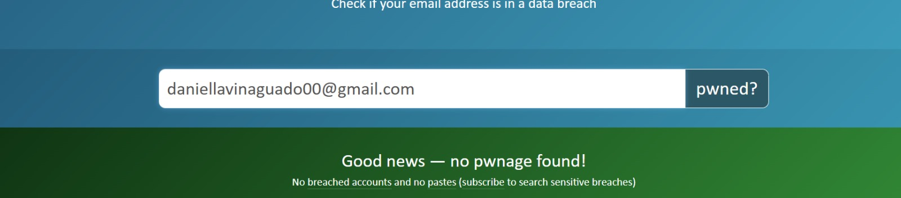
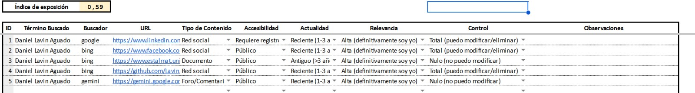

# 2022020010
---
## ego surfing

## Análisis de plataformas

### Redes sociales tradicionales

| Plataforma | Presencia | Usuario                 | Observaciones                                      |
|------------|----------|-------------------------|----------------------------------------------------|
| Facebook   | Sí       | Daniel Lavin Aguado     | Cuenta solamente para ver noticias                |
| Instagram  | Sí       | danielobix04            | Cuenta actualmente activa                         |
| LinkedIn   | Sí       | Daniel Lavin Aguado     | Perfil actualmente activo pero desactualizado     |
| X          | No       |        ---              |                 ---                               |

### Plataformas emergentes

| Plataforma | Presencia | Usuario            | Observaciones          |
|------------|----------|--------------------|------------------------|
| BeReal     | Sí       | danielobix04       | Mucho uso diario      |
| Threads    | No       | ---                | ---                    |
| Mastodon   | No       | ---                | ---                    |
| Discord    | No       |                    |                       |
| Tiktok     | Sí       | danielobix00       | Demasiado uso diario  |

### Foros

| Plataforma | Usuario                 | Observaciones|
|------------|----------|-------------------------|
| Reddit   |  ---    | ---     |
| Github          | LavinAguado          | Cuenta para fines academicos  |

### Interconexion entre plataformas

Ninguna de mis cuentas creadas en redes sociales estan interconectadas, la única interconexión es la similitud de nombres de usuario en todas las redes sociales.

