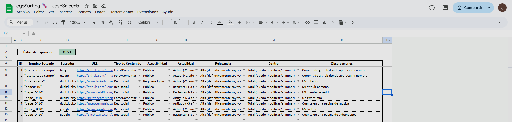
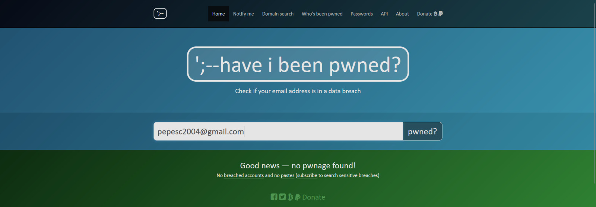
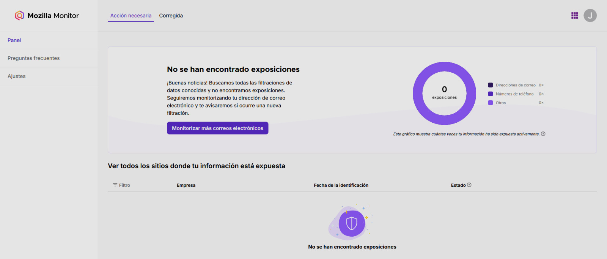
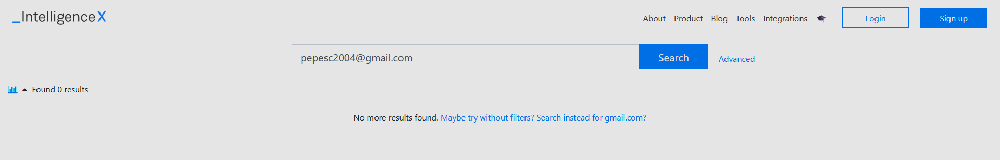

# 2022020018
---
## Ego surfing

## Análisis de plataformas

### Redes sociales tradicionales

| Plataforma | Presencia | Usuario                 | Observaciones                                      |
|------------|----------|-------------------------|----------------------------------------------------|
| Facebook   | Si       | José Salceda          | No la uso nunca                        |
| Instagram  | Sí       | Peepee_0410             | Cuenta actualmente activa                         |
| LinkedIn   | Sí       | José Salceda    | Cuenta actualmente activa     |
| X          | Sí       | Peepee_0410            | Cuenta actualmente activa                     |

### Plataformas emergentes

| Plataforma | Presencia | Usuario            | Observaciones          |
|------------|----------|--------------------|------------------------|
| BeReal     | Sí       | Peepee_0410     | Cuenta sin uso      |
| Threads    | No       | ---                | ---                    |
| Mastodon   | No       | ---                | ---                    |
| Discord    | Sí       | Pepe_0410     | Uso ocasional          |
| Tiktok     | Sí       | Pepe_0410     | No lo uso nunca  |

### Foros

| Plataforma | Usuario                 | Observaciones|
|------------|----------|-------------------------|
| Reddit   |  Pepe_0410    | ---     | Uso ocasional
| Github          | Pepe_0410            | Cuenta para fines academicos  |

### Interconexion entre plataformas

Ninguna de mis cuentas creadas en redes sociales estan interconectadas, la única interconexión es la similitud de nombres de usuario en todas las redes sociales.