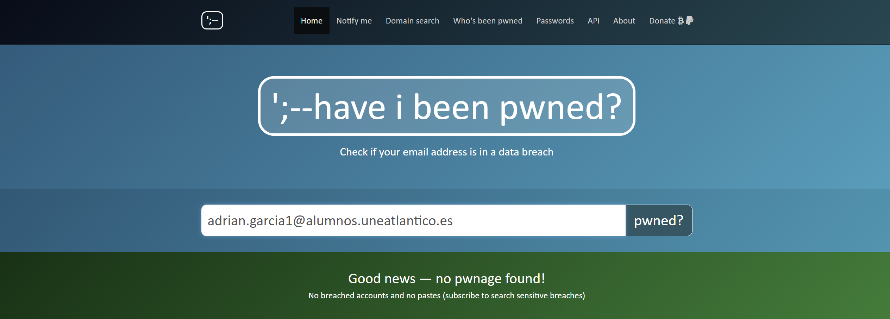
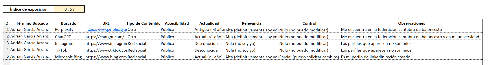

# 2022020043
---
## Ego surfing

## Análisis de plataformas

### Redes sociales tradicionales

| Plataforma | Presencia | Usuario                 | Observaciones                                      |
|------------|----------|-------------------------|----------------------------------------------------|
| Facebook   | No       | ---          | ---                         |
| Instagram  | Sí       | aadrigaar_             | Cuenta actualmente activa                         |
| LinkedIn   | Sí       | Adrián García Arranz    | Cuenta actualmente activa     |
| X          | Sí       | aadrigaar_            | Cuenta solo para ver noticias                     |

### Plataformas emergentes

| Plataforma | Presencia | Usuario            | Observaciones          |
|------------|----------|--------------------|------------------------|
| BeReal     | Sí       | aadrigaar     | Cuenta sin uso      |
| Threads    | No       | ---                | ---                    |
| Mastodon   | No       | ---                | ---                    |
| Discord    | Sí       | aadrigaar_     | Uso ocasional          |
| Tiktok     | Sí       | aadrigaar_     | Demasiado uso diario  |

### Foros

| Plataforma | Usuario                 | Observaciones|
|------------|----------|-------------------------|
| Reddit   |  ---    | ---     |
| Github          | aadrigaar            | Cuenta para fines académicos  |

### Interconexion entre plataformas

Ninguna de mis cuentas creadas en redes sociales estan interconectadas, la única interconexión es la similitud de nombres de usuario en todas las redes sociales.
